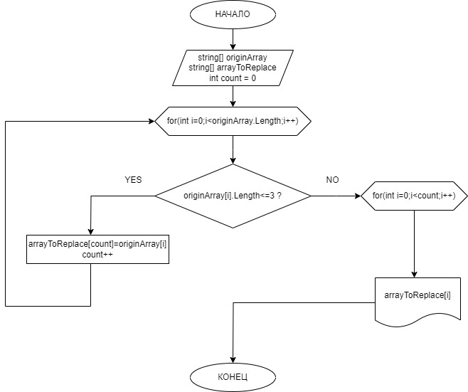

# **Итоговая котрольная работа по основному блоку**

## Для прохождения аттестации по основному блоку "Разработчик" дана задача:

```sh
Написать программу, которая из имеющегося массива строк формирует новый массив из строк, длина которых меньше, либо равна 3 символам. Первоначальный массив можно ввести с клавиатуры, либо задать на старте выполнения алгоритма. При решении не рекомендуется пользоваться коллекциями, лучше обойтись исключительно массивами.
```

## Алгоритм решения задачи выглядит следующим образом:
1. Формируются 2 массива одинаковой величины и вводится счетчик count, изначально равный 0.

2. Далее при помощи цикла for мы "пробегаемся" по величине массива.

3. В первом цикле for создаётся условие, при котором если первый(оригинальный) массив меньше или равен 3 символам(как в условии задачи), при помощи счетчика count увеличиваем массив на 1 единицу.

4. Во втором цикле for выполняется условие задачи и выводится на экран второй массив, в условие которого входит отражение символов из первого массива, но не более трех.

## Блок- схема решения алгоритма задачи приведена далее в виде изображения jpg:
[]

*Так же блок-схемы в форматах jpg и drawio приложены к настоящему репозиторию в отдельной папке scheme*